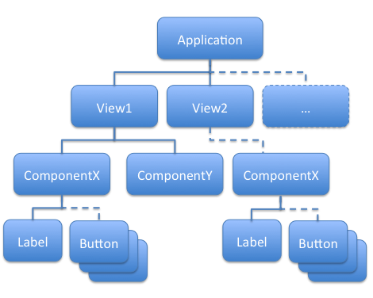

# Application météo

- [Comment installer Node et npm](#installnpm)
- [Comment créer une application React](#appreact)
- [Afficher un tableau des emplacements](#locationtable)
- [Introduction aux States](#states)
- [Affichage du tableau de localisation](#location)
- [Ajout d’un emplacement](#addlocation)
- [Plus d’optimisation](#optimisation)
- [Découper en composants](#cutcomponent)
- [Composant LocationSearch](#locationsearch)
- [Ajout de props aux composants](#props)
- [Composant LocationTable](#locationtable)
- [Création d'une couche service](#servicelayer)
- [Utilisation du service dans nos composants](#useservices)
- [Affichage de la météo actuelle](#weather)
- [Ajout d'un emplacement actuel](#actuallocation)
- [Création d'un composant d'entrée météo unique](#weathercomponent)

Nous allons créer une application d’information météo grâce à [React](https://fr.wikipedia.org/wiki/React). Un framework frontend
JavaScript libre développé par Facebook depuis 2013. Celui-ci permet de développer des pages ou parties de page internet réutilisables.

Les frameworks frontend Javascript nécessitent un environnement de développement fourni par le serveur applicatif Javascript [Node.JS](https://nodejs.org/en/).

## <a name="installnpm"></a>Comment installer Node et npm

Pour créer notre application React, nous avons besoin d'un environnement d'exécution appelé Node. Il est principalement utilisé pour exécuter
du code JavaScript.

Pour le télécharger, rendez-vous sur [Node.JS](https://nodejs.org/en/).

Vous aurez également besoin de npm, qui est un gestionnaire de packages construit sur Node. Vous pouvez l'utiliser pour installer des packages
pour vos applications JavaScript. Heureusement, il est livré avec Node, vous n'avez donc pas besoin de le télécharger séparément.

Une fois les deux terminés, ouvrez votre terminal ou votre invite de commande et tapez :

```
node -v
```

Cela vérifie quelle version de Node vous avez.

## <a name="appreact"></a>Comment créer une application React

Pour créer notre application React, tapez:

```
create-react-app <Votre nom d'application>
```

dans votre terminal, ou

```
create-react-app my-weather-app
```

dans ce cas.

Vous verrez que les packages sont en cours d'installation.

Une fois les packages terminés, allez dans le dossier du projet et tapez:

```
npm start
```

Vous verrez le modèle React par défaut, comme ceci :


    Modèle d’application React par défaut


Nous n'avons pas besoin de tout ce code, alors, nous pouvons en retirer.

Dans votre fichier app.js, effacez tout à l'intérieur de la balise div. Supprimez l'importation du logo.

Vous verrez un écran vide dans votre navigateur une fois que vous l'aurez fait.

Vous remarquerez également que nous importons un fichier CSS et une image SVG directement dans le code. Ces imports et le contenu des
fichiers importés ne sont plus nécessaires:

- Supprimer le contenu de App.css et index.css
- Supprimer l'importation de logo.svg de App.js
- Supprimer App.test.js et les fichiers logo

Nous allons maintenant mettre un titre à notre Application:

```js
function App() {
  return (
    <div>
      <h1>Weather App</h1>
    </div>
  );
}
```

Contenu du fichier App.js

Si tout a fonctionné, lors de l'enregistrement, le navigateur se sera automatiquement rafraichi et affichera :


## <a name="locationtable"></a>Afficher un tableau des emplacements

La première étape de notre application météo est d’offrir une liste des différents emplacements/villes que l’utilisateur peut choisir pour avoir les
informations météorologiques associées.

Ajoutons un champ dans lequel un utilisateur peut rechercher un emplacement et ajouter cet emplacement à une liste. Pour commencer,
l'emplacement sera une chaîne et la liste de tous les emplacements de la table, un tableau de chaînes de caractères.

Créez la vue en remplaçant le composant App par :

```js
function App() {
return (
<div>
<h1>Weather App</h1>
<div>
<label>
Add Location <input type="text" value="Paris"/>
</label>
<button>Search</button>
</div>
```

```js
<div>
<h2>Locations</h2>
<table>
<thead>
<tr>
<th>Name</th>
</tr>
</thead>
<tbody>
<tr><td>Belfast</td></tr>
<tr><td>New York</td></tr>
</tbody>
</table>
</div>
</div>
);
}
```

Comme vous pouvez le voir, il s'agit simplement de créer une vue de la même manière que nous le ferions avec HTML. Lorsque vous
enregistrez l'application devrait ressembler à :


Notez que le champ de saisie ne fonctionne pas. C'est parce que nous avons spécifié sa valeur comme constante « Paris » et React contrôle le
rendu de la vue, y compris le contenu du champ.

## <a name="states"></a>Introduction aux States

Nous devons donc déclarer une variable dans le State pour représenter le contenu du champ. Le State correspond aux données liées à la vue -
React restitue et met à jour la vue lors d’un changement dans les variables de son State.

Nous allons utiliser le State avec une class React, nous verrons par la suite l’utilisation des Hooks.

Nous allons donc transformer notre fonction App par une classe et déclarer une variable locationSearch dans le State de la classe pour
permettre de récupérer la valeur du champ Add Location:

```js
import React, { Component } from "react";
//...
class App extends Component {
constructor(props) {
super(props);
```

```js
this.state = {
locationSearch: "",
};
}
//...
```

Nous allons pouvoir lier cette variable à notre champ recherche:

```js
<label>
  Add Location <input type="text" value={locationSearch} />
</label>
```

Notez que l'affectation d'attribut de valeur n'utilise pas de guillemets. Lors de l'attribution d'attributs avec des expressions dans React, nous
utilisons toujours attribute={expression}, pas attribute="{expression}".

Enfin, nous devons ajouter un gestionnaire d'évènements onChange (notez le camel-case du nom de l'évènement) pour appeler une fonction
setLocationSearch chaque fois que le champ change. Cela permet de mettre à jour la valeur de notre champ. Encore une fois, nous utilisons {}
pour fournir une expression de fonction flèchée :

```js
<label>
  Add Location{" "}
  <input
    type="text"
    value={locationSearch}
    onChange={(event) => this.onChangeEvent(event)}
  />
</label>
```

Ainsi, lorsque le gestionnaire d'évènements onChange se déclenche, la variable du State est défini, ce qui déclenche à son tour un nouveau
rendu et met à jour la valeur du champ.

## <a name="location"></a>Affichage du tableau de localisation

Nous allons pouvoir ajouter une variable dans notre State pour gérer la liste des emplacements/villes.

```js
import React, { Component } from "react";
//...
class App extends Component {
constructor(props) {
super(props);
```

```js
this.state = {
locationSearch: "",
locations: ['Belfast', 'New York'],
};
}
//...
```

Nous mettrons deux premières villes dans le tableau pour voir si tout fonctionne.

Pour afficher cela dans la vue, nous devons avoir une ligne tr pour chaque entrée du tableau. Il faudra donc faire une boucle à travers le tableau
pour l’afficher :

```js
class App extends Component {
constructor(props) {
super(props);
```

```js
this.state = {
locationSearch: "",
locations: ['Belfast', 'New York'],
};
//...
render(){
return (
//...
<table>
<thead>
<tr>
<th>Name</th>
</tr>
</thead>
<tbody>
{locations.map(location =>
<tr><td>{location}</td></tr>
)}
</tbody>
</table>
//...
);
}
//...
```

Notez comment, dans la fonction fléchée de map, nous pouvons retourner une expression JSX imbriquée et que JSX peut à son tour contenir
une expression {} imbriquée.

```js
<tbody>
  {locations.map((location) => (
    <tr>
      <td>{location}</td>
    </tr>
  ))}
</tbody>
```

Nous devons encore apporter un dernier changement. Avec des listes d'éléments, React souhaite une clé unique pour chaque entrée afin de
pouvoir effectuer efficacement le suivi des modifications. Plus tard, nous utiliserons l'identifiant d'emplacement, mais pour l'instant, nous pouvons
simplement utiliser l'index dans le tableau :

```js
<tbody>
  {locations.map((location, index) => (
    <tr key={index}>
      <td>{location}</td>
    </tr>
  ))}
</tbody>
```

Si tout a fonctionné, la vue devrait maintenant ressembler à ce qu'elle était avec un contenu statique :


## <a name="addlocation"></a>Ajout d’un emplacement

Pour prendre en charge l'ajout d'un emplacement, nous devons déclencher une action lorsque le bouton de recherche est cliqué. Ceci est
similaire au gestionnaire d’évènements du champ, mais au lieu d'un événement onChange, nous gérons maintenant un événement onClick.
Notez que nous modifions le tableau locations en définissant une toute nouvelle valeur dans le State. Nous utilisons également locationSearch
comme données à ajouter.

```js
//...
addLocation(){
this.setState(({ locations }) => ({
locations: [this.state.locationSearch, ...locations],
}));
};
//...
<button onClick={this.addLocation}>Search</button>
```

Améliorons un peu plus le code :

- Sortez le gestionnaire en tant que const local
- Désactivez le bouton si locationSearch est vide
- Définir le texte de recherche à vide après la recherche

```js
//...
// Désactivez le bouton si locationSearch est vide
const disableSearch = locationSearch.trim() === '';
//Sortez le gestionnaire en tant que const local
const addLocation = () => {
this.setState(({ locations }) => ({
locations: [this.state.locationSearch, ...locations],
//Définir le texte de recherche à vide après la recherche
locationSearch: "",
}));
};
//...
return (
//...
<button
onClick={this.addLocation}
disabled={this.disableSearch}
>
Search
</button>
//...
```

## <a name="optimisation"></a>Plus d’optimisation

Nous pouvons supprimer les données factices initiales de nos States.

```js
class App extends Component {
constructor(props) {
super(props);
```

```js
this.state = {
locationSearch: "",
locations: [],
};
//...
render(){
return (
//...
```

Ajoutons également Bootstrap pour un style de base. Tout d'abord, ajoutez le package à notre projet,

```
npm install --save bootstrap
```

Ensuite, importez le CSS - nous pouvons le faire directement dans le code dans index.js puisque react-scripts le prend en charge.

```js
import "bootstrap/dist/css/bootstrap.min.css";
```

Nous pouvons maintenant utiliser les classes Bootstrap sur nos éléments d'interface utilisateur. Notez l'utilisation de l’attribut className au lieu
de class.

```js
function App() {
...
return (
<div className="container">
<h1>Weather App</h1>
<div>
<label>
Add Location
<input className="ml-1 mr-1" type="text" value=
{locationSearch}
onChange={(event) => this.onChangeEvent(event)}/>
</label>
<button className="btn btn-primary"
onClick={addLocation} disabled={disableSearch}>Search<
/button>
</div>
```

```js
<div>
<h2>Locations</h2>
<table className="table table-hover">
...
}
```

L’application est maintenant plus conviviale


## <a name="cutcomponent"></a>Découper en composants

Passons maintenant à une étape importante dans le développement de notre application.

Notre application n'a actuellement qu'un seul composant, App. Idéalement chaque partie devrait être indépendante, la recherche et le tableau
vont donc avoir leurs propres composants. Il s'agit d'une pratique courante pour créer des interfaces utilisateur qui vont structurer l'application
sous la forme d'une arborescence de composants :



## <a name="locationsearch"></a>Composant LocationSearch

Nous avons déjà vu avec App que les composants peuvent être écrits simplement sous forme de fonctions. Il faut juste se rappeler que le nom
doit commencer par une majuscule. Nous les créerons également généralement dans leur propre fichier.

Commençons par un composant LocationSearch en créant un fichier appelé LocationSearch.js et en y plaçant le code suivant :

```js
import React from "react";
```

```js
function LocationSearch() {
  return (
    <div>
      <label>
        Add Location{" "}
        <input
          className="ml-1 mr-1"
          type="text"
          value={locationSearch}
          onChange={(event) => this.onChangeEvent(event)}
        />
      </label>
      <button
        className="btn btn-primary"
        onClick={this.addLocation}
        disabled={this.disableSearch}
      >
        Search
      </button>
    </div>
  );
}
```

Ici, Nous allons couper et coller cette partie de recherche de la vue à partir du fichier App.js.

Notez également que l’on importe React sur la première ligne. Avant React 17, cette ligne était requise dans tous les fichiers utilisant JSX. Cela
est dû au fait que les balises ont finalement été converties en appels à React.createElement. Dans React 17, cette transformation a changé et
cette importation n'est pas requise.

Ensuite, nous devons penser à notre State - la chaine de caractères locationSearch du State doit-elle appartenir à App ou LocationSearch?
Dans ce cas, le texte saisi est transitoire et nous allons donc pouvoir le déplacer dans ce nouveau composant. Transformons notre fonction en
class et ajoutons lui ses variables

```js
import React, { Component } from "react";
```

```js
class LocationSearch extends Component {
constructor(props) {
super(props);
```

```js
this.state = {
locationSearch: "",
};
}
```

```js
onChangeEvent = (event) => {
  const newLocationSearch = event.target.value;
  this.setState({
    locationSearch: newLocationSearch,
  });
};
```

```js
const addLocation = () => {
  this.setState(({ locations }) => ({
    locations: [this.state.locationSearch, ...locations],
    //Définir le texte de recherche à vide après la recherche
    locationSearch: "",
  }));
};
```

```js
render() {
const { locationSearch } = this.state;
this.disableSearch = locationSearch.trim() === "";
```

```js
return (
<div>
<label>
Add Location{" "}
<input
className="ml-1 mr-1"
type="text"
value={locationSearch}
onChange={(event) => this.onChangeEvent(event)}
/>
</label>
<button
className="btn btn-primary"
onClick={this.addLocation}
```

```js
disabled={this.disableSearch}
>
Search
</button>
</div>
);
}
}
```

```js
export default LocationSearch;
```

Le gestionnaire onClick, cependant, modifie la variable locations du State. Je ne veux pas de la variable locations du State dans ce composant
car d'autres parties de mon application l'utiliseront aussi, donc à la place, je laisserai cette variable dans App. Je dois communiquer à partir de ce
composant enfant vers l'application chaque fois que le bouton de recherche a été cliqué - nous le faisons en définissant une props.

## <a name="props"></a>Ajout de props aux composants

Une props est une entrée d'un composant spécifié en tant qu'attribut dans JSX. Par exemple:

```js
<LocationSearch prop1={...} prop2={...}/>
```

Tous les props sont regroupés dans un objet qui est passé à notre composant en tant que paramètre. Nous pouvons penser au State comme
appartenant au composant et est en lecture écriture. Les props sont en lecture seule et n'appartiennent pas au composant, elles sont transmises.

Notez que le rappel prend une chaîne plutôt qu'un paramètre click MouseEvent. C'est une autre chose utile à propos des composants, nous
pouvons masquer les détails de bas niveau et créer des interfaces plus propres. Nous pouvons passez une fonction en props pour que le
composant App fasse le changement dans le tableau location.

De

```js
const addLocation = () => {
  this.setState(({ locations }) => ({
    locations: [this.state.locationSearch, ...locations],
    //Définir le texte de recherche à vide après la recherche
    locationSearch: "",
  }));
};
```

Vers

```js
const addLocation = () => {
  this.setState(() => ({
    locationSearch: "",
  }));
  this.props.onSearch(this.state.locationSearch);
};
```

Enfin, nous pouvons mettre à jour App.js pour utiliser ce nouveau composant :

```js
import LocationSearch from "../components/LocationSearch";
import React, { Component } from "react";
```

```js
class App extends Component {
constructor(props) {
super(props);
```

```js
this.state = {
locations: [],
//...
};
}
```

```js
addLocation = (term) => {
  const location = searchLocation(term);
  this.setState(({ locations }) => ({
    locations: [location, ...locations],
  }));
};
```

```js
render() {
//...
return (
<div className="container">
<LocationSearch onSearch={this.addLocation} />
//...
</div>
);
}
}
```

```js
export default App;
```

## <a name="installnpm"></a>Composant LocationTable

Pour le composant LocationTable, c'est un processus similaire.

- Créez un fichier appelé LocationTable.js
- Déplacez la vue contenant le table d’emplacements de App.js dans le fichier du nouveau composant.
- Ajouter une interface pour les props - dans ce cas les emplacements à afficher

LocationTable.js

```js
import React, { Component } from "react";
```

```js
class LocationTable extends Component {
  render() {
    const { locations } = this.props;
    return (
      <div>
        <h2>Locations</h2>
        <table className="table table-hover">
          <thead>
            <tr>
              <th>Name</th>
            </tr>
          </thead>
          <tbody>
            {locations.map((location) => (
              <tr key={location.id}>
                <td>
                  <div onClick={() => this.props.onSelect(location)}>
                    {location.name}
                  </div>
                </td>
              </tr>
            ))}
          </tbody>
        </table>
      </div>
    );
  }
}
```

```js
export default LocationTable;
```

App.js peut ensuite être mis à jour pour consommer ce nouveau composant :

App.js

```js
import LocationSearch from "../components/LocationSearch";
import LocationTable from "../components/LocationTable";
```

```js
import React, { Component } from "react";
```

```js
class App extends Component {
constructor(props) {
super(props);
```

```js
this.state = {
locations: [],
};
}
```

```js
addLocation = (term) => {
  const location = searchLocation(term);
  this.setState(({ locations }) => ({
    locations: [location, ...locations],
  }));
};
```

```js
render() {
const { locations } = this.state;
return (
<div className="container">
<LocationSearch onSearch={this.addLocation} />
<LocationTable
locations={locations}
current={currentLocation}
onSelect={(location) => this.setCurrentLocation(location)}
/>
</div>
);
}
}
```

```js
export default App;
```

## <a name="servicelayer"></a>Création d'une couche service

Pour éviter d'encombrer les composants, nous allons créer une couche d'interface de service pour communiquer avec une API. Cela pourrait
être une classe ou simplement des fonctions - utilisons des fonctions. Pour notre exemple nous bouchonnerons l’appel à l’API plutôt que de
prendre trop de temps pour faire la configuration et l’appel à celle-ci.

Pour créer notre service, nous allons créer un fichier WeatherService.js. Pour ajouter une structure pour aider à organiser notre projet, créons
quelques dossiers :

- components - contiennent tous nos composants
- services - contiennent tous nos services
- model - contient nos fichiers modèles


Nous pouvons modéliser l'objet entier retourné par l’API ou seulement les parties que nous voulons utiliser. Définissons un sous-ensemble qui
corresponds aux informations revenant de l'API. Ce modèle d’objet sera déclaré dans un nouveau fichier model/Weather.js.

```js
export class Coordinates {
  constructor(lon, lat) {
    this.lon = lon;
    this.lat = lat;
  }
}
```

```js
export class WeatherLocation {
  constructor(coord, id, name) {
    this.coord = coord;
    this.id = id;
    this.name = name;
  }
}
```

Enfin nous allons mettre en dur des valeurs dans un fichier WeatherService.js pour simuler notre appel d’API:

```js
//Tableau des emplacements-villes retournes par l'API
const cities = [
  {
    id: 1,
    name: "Paris",
  },
  {
    id: 2,
    name: "Londres",
  },
  {
    id: 3,
    name: "New york",
  },
  {
    id: 4,
    name: "Belfast",
  },
  {
    id: 5,
    name: "Montreal",
  },
  {
    id: 6,
    name: "Toronto",
  },
  {
    id: 7,
    name: "Vancouver",
  },
  {
    id: 8,
    name: "San Francisco",
  },
  {
    id: 9,
    name: "Rome",
  },
  {
    id: 10,
    name: "Sydney",
  },
];

//Retour des donnees meteo pour un emplacement specifique
const weather = {
  coord: {
    lon: 2.3488,
    lat: 48.8534,
  },
  weather: [
    {
      id: 800,
      main: "Clear",
      description: "clear sky",
      icon: "01n",
    },
  ],
  base: "stations",
  main: {
    temp: 17.52,
    feels_like: 16.89,
    temp_min: 14.03,
    temp_max: 19.52,
    pressure: 1017,
    humidity: 60,
  },
  visibility: 10000,
  wind: {
    speed: 2.06,
    deg: 280,
  },
  clouds: {
    all: 0,
  },
  dt: 1625691510,
  sys: {
    type: 2,
    id: 2012208,
    country: "FR",
    sunrise: 1625630130,
    sunset: 1625687710,
  },
  timezone: 7200,
  id: 2988507,
  name: "Paris",
  cod: 200,
};
```

```js

//fonctions visibles par les composants pour afficher les informations
a l utilisateur
export function searchLocation(term) {
return cities.find((item) => item.name === term);
}

```

```js
export function readWeather(locationId) {
  return weather;
}
```

```js
export function getIconUrl(code) {
  return `http://openweathermap.org/img/wn/${code}.png`;
}
```

## <a name="useservices"></a>Utilisation du service dans nos composants

Maintenant que nous avons notre modèle et notre couche de service, nous pouvons commencer à l'intégrer dans nos composants. Nous
pouvons d'abord ajouter la recherche. Lorsqu'un événement onSearch se déclenche, au lieu d'ajouter la chaîne à un tableau, nous devons :

- Appelez notre fonction API readWeather
- Afficher une erreur si rien n'est trouvé ou un avertissement s'il est déjà présent
- Cela nécessitera un nouvel état
- Ajoutez l'emplacement au tableau des emplacements s'il est trouvé

```js

//...
class App extends Component {
constructor(props) {
super(props);

```

```js

this.state = {
locations: [],
warning: "",
error: "",
};
}
//...

```

L'erreur et l'avertissement peuvent alors être intégrés dans la vue :

```js

//...
render() {
const { error, warning, locations} = this.state;
return (

<div className="container">
<LocationSearch onSearch={this.addLocation} />
{
error
? <div className={`alert alert-danger`}>{error}</div>
: null
}
{
warning
? <div className={`alert alert-warning`}>{warning}</div>
: null
}
<LocationTable
locations={locations}
/>
</div>
);
}
//...
```

Nous pouvons voir que les deux blocs sont presque identiques, c'est donc l'occasion idéale de les diviser en composants.

Ensuite, modifions le gestionnaire addLocation pour effectuer une recherche, en réinitialisant l'erreur et l'avertissement au préalable.

```js
resetAlerts = () => {
  this.setState({
    warning: "",
    error: "",
  });
};
```

```js
addLocation = (term) => {
this.resetAlerts();
```

```js
const location = searchLocation(term);
if (!location) {
this.setState({
error: `No location found called '${term}'`,
});
} else if (
this.state.locations.find((item) => item.name === location.name)
) {
this.setState({
warning: `Location '${term}' is already in the list.`,
});
} else {
this.setState(({ locations }) => ({
locations: [location, ...locations],
}));
}
};
```

Si tout fonctionne, l'application devrait maintenant être en mesure de rechercher des emplacements et d'afficher les erreurs.


## <a name="weather"></a>Affichage de la météo actuelle

### <a name="actuallocation"></a>Ajout d'un emplacement actuel

Nous devons avoir un State au niveau supérieur pour représenter l'emplacement « actuel ». Cela doit être mis en évidence dans le tableau et
l'utilisateur doit pouvoir le sélectionner dans le tableau des emplacements.

Cela signifie que nous devrons avoir le State de l'emplacement actuel dans App et le transmettre dans le tableau. La table doit également
informer App via un callback si la ligne sélectionnée a changé

```js
class App extends Component {
constructor(props) {
super(props);
```

```js
this.state = {
locations: [],
warning: "",
error: "",
currentLocation: null,
};
}
//...
render() {
const { error, warning, locations, currentLocation } = this.state;
return (
<div className="container">
<LocationSearch onSearch={this.addLocation} />
//...
<LocationTable
locations={locations}
current={currentLocation}
onSelect={(location) => this.setCurrentLocation(location)}
/>
</div>
);
}
}
```

Ensuite, dans le composant LocationTable, nous devons :

- Ajoutez de nouvelles props
- Déstructurez-les dans les paramètres des composants
- Câbler le formatage de surbrillance en fonction de l'accessoire actuel
- Connectez les gestionnaires de clics sur les lignes pour déclencher un callback onSelect avec l'emplacement correct.

```js
import React, { Component } from "react";
```

```js
class LocationTable extends Component {
render() {
const { locations, current} = this.props;
return (
<div>
<h2>Locations</h2>
<table className="table table-hover">
<thead>
<tr>
<th>Name</th>
</tr>
</thead>
<tbody>
{locations.map((location) => (
<tr
className={current?.id === location.id? "table-
primary" : ""}
key={location.id}
>
<td>
<div onClick={() => this.props.onSelect(location)}>
{location.name}
</div>
</td>
</tr>
))}
</tbody>
</table>
</div>
);
}
}
```

```js
export default LocationTable;
```

Nous avons maintenant une table où nous pouvons sélectionner l'emplacement actuel.


### <a name="weathercomponent"></a>Création d'un composant d'entrée météo unique

Créons maintenant un composant pour restituer des informations sur un objet météo qui seront transmises via des props. Cela nécessite un peu
de prévoyance car nous allons instancier cela plusieurs fois pour nos prévisions.

Créez un fichier components/WeatherEntry.js et ajoutez le code suivant :

```js
import React, { Component } from "react";
import { getIconUrl } from "../services/WeatherService";
```

```js
class WeatherEntry extends Component {
convertUnixTimeToDate = (unixUtc) => {
return new Date(unixUtc * 1000);
};
```

```js
render() {
const { weather } = this.props;
return (
<div>
<div>{this.convertUnixTimeToDate(weather.dt).
toLocaleTimeString()}</div>
<div>
<strong>{weather.main.temp}°C</strong>
<div>
({weather.main.temp_min}°C / {weather.main.temp_max}°C)
</div>
</div>
<div>Humidity: {weather.main.humidity}%</div>
{weather.weather.map((condition) => (
<div key={condition.id}>
{" "}
{condition.main} {condition.description}
</div>
))}
</div>
);
}
}
```

```js
export default WeatherEntry;
```

Créons ensuite un composant components/WeatherSummary.js qui recevra un emplacement éventuellement nul lira les informations
météorologiques sur cet emplacement et les affichera à l'aide du composant WeatherEntry précédemment déclaré.

```js
import React, { Component } from "react";
import WeatherEntry from "./WeatherEntry";
import { readWeather } from "../services/WeatherService";
```

```js
class WeatherSummary extends Component {
constructor(props) {
super(props);
this.result = null;
this.state = {
weather: null,
};
}
```

```js
getWeather = () => {
  const { location } = this.props;
  if (location && !this.result) {
    this.result = readWeather(location.id);
    this.setState({ weather: this.result });
  }
};
```

```js
componentDidUpdate() {
this.getWeather();
}
```

```js
render() {
const { location } = this.props;
const { weather } = this.state;
```

```js
if (!location || !weather) return null;
```

```js
return (
<div>
<hr />
<h2>{location.name}</h2>
<WeatherEntry weather={weather} />
</div>
);
}
}
```

```js
export default WeatherSummary;
```

Enfin, nous pouvons l'utiliser au niveau supérieur dans App.js :

```js
//...
render() {
const { error, warning, locations, currentLocation } = this.state;
return (
<div className="container">
<LocationSearch onSearch={this.addLocation} />
<Alert message={error} class="alert-danger" />
<Alert message={warning} class="alert-warning" />
<LocationTable
locations={locations}
current={currentLocation}
onSelect={(location) => this.setCurrentLocation(location)}
/>
<WeatherSummary location={currentLocation} />
</div>
);
}
//...
```

Voici le resultat final de notre application météo!


